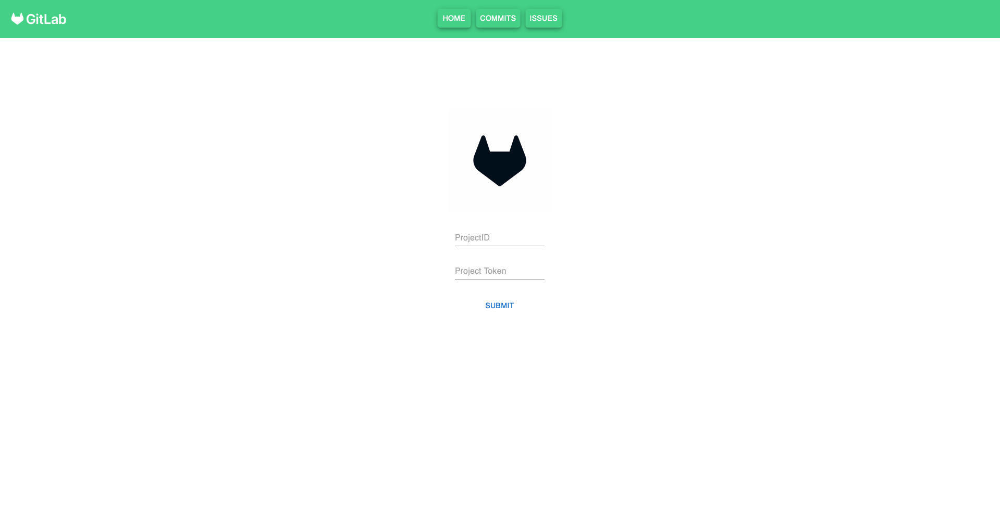
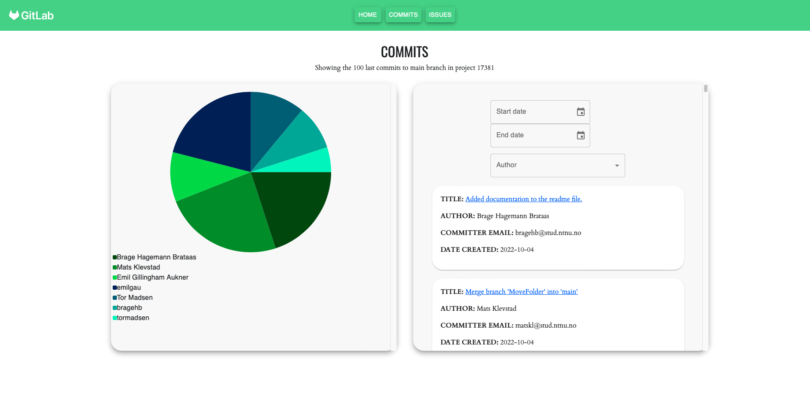
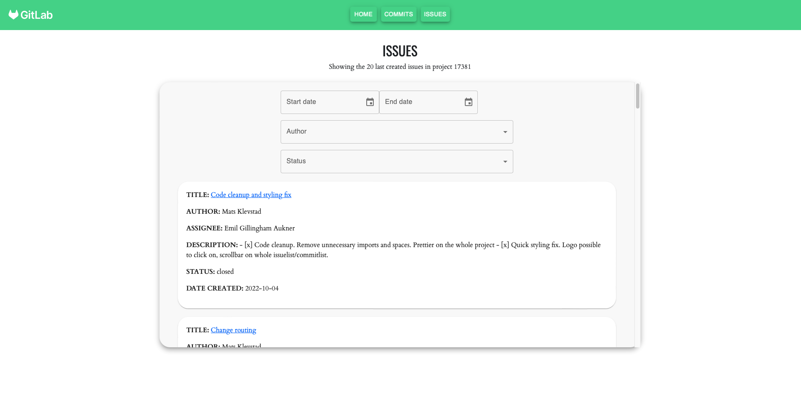

## Hvordan kjøre prosjektet

Åpne en ny terminal og kjør disse kommandoene:

1. `npm i`
2. `npm start`

## Dokumentasjon
Her har vi dokumentert designvalgene våre og bruk av teknologier.

## Responsivt design
Løsningen vår er tilpasset slik at den har et responsivt design, uavhengig om man er på pc, mobil eller nettbrett. For å få til dette har ingen sideelementer i løsningen vår en fast størrelse. Vi satte størrelsen til hovedelementene på sidene med viewport, og child elementer for de elementene til en prosentandel av sine foreldre. Som en følge av dette skalerer nettsiden seg jevnt når man minimerer vinduet. Dersom skjermen er liten (en telefon eller nettbrett) vil elementene på siden ha en passelig størrelse. Dette har vi testet jevnlig i nettleseren ved å velge ulike enheter med “inspect element”. Vi har brukt Iphone 12 Pro, iPad Air og vanlig skjermstørrelse på pc. Slik har vi kunnet kontrollere at ulike skjermstørrelser ikke påvirker brukeropplevelsen. Vi har også fått sjekket at horisontal og vertikal orientering på mindre skjermer gir et responsivt design for brukeren. Videre har vi aktivt utført cross-browser testing på nettsiden underveis i prosjektarbeidet. Nettleserne vi har testet prosjektet på er Google Chrome, Firefox og Safari. Oppførselen er lik på de ulike nettleserne. 

## Styling og UI-komponenter
I løsningen vår har vi benyttet oss av flere komponenter fra det eksterne biblioteket “Material-UI” (MUI). Vi har brukt komponent biblioteket for å importere UI-komponenter der vi selv har implementert funksjoner for å håndtere data og endringer. Blant annet har vi brukt UI-komponenter for å vise en kalender og et stylet select komponent, som sparte oss fra å bruke tid på å style standard html noder. Vi har vurdert det til at vi uansett viser kunnskap og erfaringer i React/Typescript da vi selv håndterer implementasjonen av komponentet, f.eks. onChange og onClick håndtering.

På grunn av vår bruk av MUI-komponenter har det ikke vært like lett å drive tradisjonell styling i en .css-fil. Vi kunne brukt inline-styling i komponentene, men dette synes vi virket uoversiktelig. Derfor lagde vi en style-fil (en .tsx fil kalt style) med konstanter som inneholder stil-egenskapene vi ønsket for komponenter, også kalte vi på konstantene i komponentenes inline styling felt. På denne måten ble stylingen lettere å finne og lese. På grunn av denne implementasjonen var det ikke lett å håndtere media queries, ettersom style-filen ikke har støtte for @media. Vi har derimot fått til media queries på enkelte deler av nettsiden ved å bruke .css-filer. Diagram og commits plasseres under hverandre og GitLab logoen fjernes når skjermen minimeres.

Ideelt sett burde man brukt media queries flere plasser for å lettere endre plassering/størrelse på komponenter når vindusstørrelsen blir mindre. MUI har innebygd støtte for å minimere komponenter i takt med vindusstørrelsen, og vi mener at brukeropplevelsen likevel forblir god selv om media queries ikke er brukt overalt. 

Vi har valgt å samle sideelementene på en side inn i en felles ramme med skygge. Slik er det mer intuitivt for brukeren å se hvilke elementer på nettsiden man skal fokusere på. 
Dessuten blir det mer tydelig at innholdet i rammen er det som endres på dersom man f.eks. endrer på en filterfunksjon. Derfor er diagram og liste over commits splittet opp i to rammer, ettersom filterfunksjonaliteten ikke påvirker diagrammet på CommitsPage.

## Web Storage, Context og Class
Vi implementerte Web Storage via en klasse i prosjektet. Vi brukte Typescript sitt Web Storage API, ettersom vi kodet prosjektet med Typescript. Det var et krav å både bruke Local Storage og Session Storage fra HTML Web Storage APIet. Metodene for begge storage-variantene var like, så vi lagde en abstrakt klasse som hadde mer spesialiserte metoder for prosjektet. Vi lagde så en SessionStorage og en LocalStorage-klasse som extended den abstrakte klassen. På denne måten kunne vi aksessere LocalStorage og SessionStorage hver for seg, uten å lage to identiske klasser. Vi brukte så LocalStorage-klassen til å lagre projectID og projectToken til nettleserens lokale lagring. Brukeren ønsker gjerne at projectID og projectToken skal huskes av nettleseren til en senere anledning. Vi brukte så Context APIet til å sende projectID og projectToken videre til andre sider på nettsiden, slik at brukeren forblir validert. Dette vil si at Context gjorde det mulig å sende videre projectID og projectToken som en global prop. Vi brukte SessionStorage til å lagre navnet valgt på navn-filteret på CommitsPage og IssuePage. Denne verdien blir med over fra CommitsPage til IssuePage og motsatt, fordi den hentes fra SessionStorage. Denne forsvinner så når nettsiden lukkes.

## GitLab data parameterisert
Vi valgte å parametrisere GitLab dataen vår ved å la brukeren sortere prosjektets commits etter navn og fra og til dato på CommitsPage. Dette gir brukeren en enkel måte å finne en spesifikk commit de ser etter. Vi gjorde det samme på IssuePage, men der la vi også til status som en parameter. På denne måten kan brukeren også sortere om issuen er åpen eller lukket. Alle disse parametrene kan velges samtidig for mer presis filtrering. 

## Knytte commits til issues
Vi valgte å knytte issues til commits ved å lage branches ut ifra issues. Vi tenkte da at GitLab holdt styr på hvilken issue en commit tilhørte, ettersom den ble pushet til den branchen. Vi oppdaget derimot mot slutten av prosjektet at den informasjonen forsvant når en branch ble merget inn i main branchen. Vi mistet da informasjonen om hvilken branch den commiten tidligere hadde tilhørt, og det var derfor ikke lett å se i ettertid hvilken issue en commit tilhørte. Dette er noe vi tar med oss videre til senere prosjektarbeid.

## Hvordan vi har testet
Vi fant ut litt for sent at MUI-komponenter er vanskelig å integrere med Jest komponenttesting. Vi har fått laget snapshot-tester som fungerer, men ikke enkle komponenttester som sjekker oppførsel, da det er veldig vanskelig å få valgt komponentet med jest når det er en MUI-komponent. I stedet utførte vi utforskende tester på alle komponenter og prøvde å ødelegge så mye vi kunne for å se om noe uforventet dukket opp. Grunnet Typescript sin strenge syntaks og MUI-komponenter sine interne tester fant vi ingen uforventede feil i siden vår gjennom utforskende testing. Til neste gang ville vi sjekket dette tidligere så vi kunne fått lagd komponenttester men fikk det dessverre ikke til i dette prosjektet etter mye frustrasjon. 

## Bilder av nettsiden

